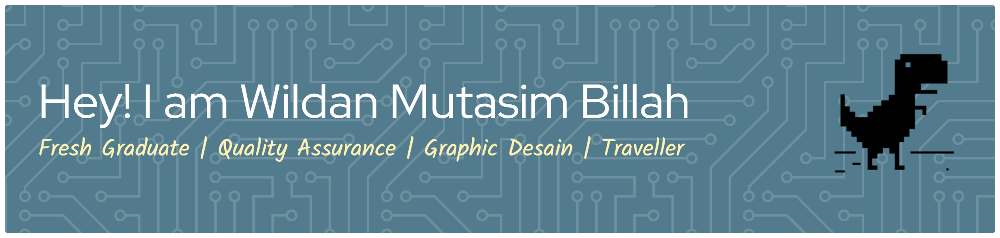

## 💻 About Me
I am a fresh graduate from **Pamulang University**, majoring in **Informatics Engineering**.  I enjoy learning new things, especially in the world of **Information Technology**. Currently, I am focusing on expanding my knowledge in the field of **Quality Assurance** to enhance my skills in software testing and product quality improvement.

### 🔧 Tech & Tools I'm Learning
- Manual Testing (Test Case, Test Plan, Bug Report)
- Automation Testing *(Selenium, Appium, Cypress)*
- SQL (Basic Query & Data Validation)
- Git & GitHub

### 🏆 Skills
#### 👩‍💻Hardskills
                  

#### 💪Softskills
Communication, Leadership, Teamwork, Public Speaking, Adaptability, Problem-Solving, Time Management,   Customer Service, Creativity, Attention to Detail

#### 🕵️‍♂️Portofolio QA
[Portofolio QA](https://github.com/Welldone39/Portofolio-QA.git)

#### 🤝 Connect With Me
   

#### My Github Stats

  
  

###

#### 🕹️ Play Games With Me

<!-- <picture>
  <source media="(prefers-color-scheme: dark)" srcset="https://raw.githubusercontent.com/Welldone39/Welldone39/output/pacman-contribution-graph-dark.svg">
  <source media="(prefers-color-scheme: light)" srcset="https://raw.githubusercontent.com/Welldone39/Welldone39/output/pacman-contribution-graph.svg">
  
</picture>

 -->

